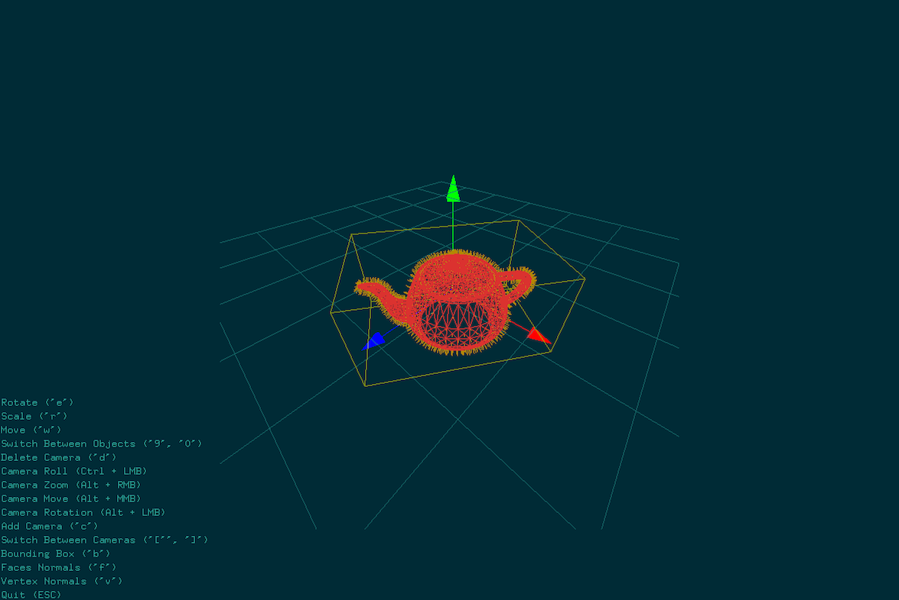

# Simple .obj mesh viewer

## Use:
program file.obj

## Screenshot:

## Mesh class:
It's a basic geometry container that supports reading from .obj files, simple
transformations and draw method.

## Scene:
Main structure, that keeps all the geometry and objects together.
